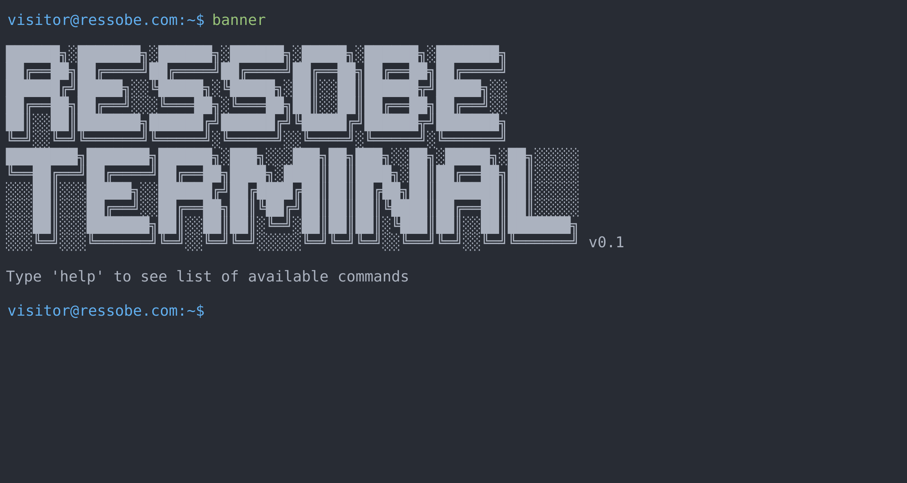

# Project Title

Terminal style website


## Description

Most of the time I'm working in terminal so I decided
to create this project. It's simple site, written in typescript

## Getting Started

### Installing

* Clone Repository
    ```
    git clone https://github.com/Ressobe/terminalSite.git 
    ```

### Run 
  * Open project folder 
  * Open index.html

## Version History

* 0.1
    * Initial Release

## License

This project is licensed under the GNU GENERAL PUBLIC License - see the LICENSE.md file for details

## Contributing

Please feel free to pull requests or log issues.

Thanks!